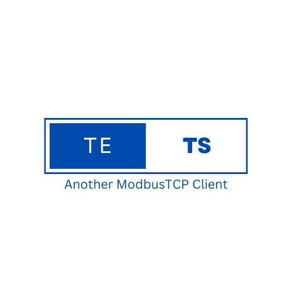

<!-- Improved compatibility of back to top link: See: https://github.com/othneildrew/Best-README-Template/pull/73 -->
<a name="readme-top"></a>
<!--
*** Thanks for checking out the Best-README-Template. If you have a suggestion
*** that would make this better, please fork the repo and create a pull request
*** or simply open an issue with the tag "enhancement".
*** Don't forget to give the project a star!
*** Thanks again! Now go create something AMAZING! :D
-->


<!-- PROJECT SHIELDS -->
<!--
*** I'm using markdown "reference style" links for readability.
*** Reference links are enclosed in brackets [ ] instead of parentheses ( ).
*** See the bottom of this document for the declaration of the reference variables
*** for contributors-url, forks-url, etc. This is an optional, concise syntax you may use.
*** https://www.markdownguide.org/basic-syntax/#reference-style-links
-->
[![Contributors][contributors-shield]][contributors-url]
[![Forks][forks-shield]][forks-url]
[![Stargazers][stars-shield]][stars-url]
[![Issues][issues-shield]][issues-url]
[![MIT License][license-shield]][license-url]
[![LinkedIn][linkedin-shield]][linkedin-url]


<!-- PROJECT LOGO -->
<br />
<div align="center">
  <a href="https://github.com/mysayasan/tets">
    
  </a>

<h3 align="center">TETS : Another Modbus/TCP client</h3>

  <p align="center">
    An application to read/write modbus registers/coil via tcp
    <br />
    <a href="https://github.com/mysayasan/tets"><strong>Explore the docs »</strong></a>
    <br />
    <br />    
    <a href="https://github.com/mysayasan/tets/issues">Report Bug</a>
    ·
    <a href="https://github.com/mysayasan/tets/issues">Request Feature</a>
  </p>
</div>


<!-- TABLE OF CONTENTS -->
<details>
  <summary>Table of Contents</summary>
  <ol>
    <li>
      <a href="#about-the-project">About The Project</a>
      <ul>
        <li><a href="#built-with">Built With</a></li>
      </ul>
    </li>
    <li>
      <a href="#getting-started">Getting Started</a>
      <ul>
        <li><a href="#prerequisites">Prerequisites</a></li>
        <li><a href="#installation">Installation</a></li>
      </ul>
    </li>
    <li><a href="#usage">Usage</a></li>
    <li><a href="#roadmap">Roadmap</a></li>
    <li><a href="#contributing">Contributing</a></li>
    <li><a href="#license">License</a></li>
    <li><a href="#contact">Contact</a></li>
    <li><a href="#acknowledgments">Acknowledgments</a></li>
  </ol>
</details>


<!-- ABOUT THE PROJECT -->
## About The Project

[![Product Name Screen Shot][product-screenshot]](https://example.com)

TETS is a Modbus TCP client program that can spawn multiple instance to fetch registers/coils from PLC/Devices with modbus server via TCP/IP. This is a simple program and to store log file, you can just use piping ex: <br /> <i>./Tets profile.xml | tee modbus.log</i>

<p align="right">(<a href="#readme-top">back to top</a>)</p>


### Built With

* [![.Net][DotNet]][DotNet-url]
* [![C#][C#]][C#-url]


<p align="right">(<a href="#readme-top">back to top</a>)</p>


<!-- GETTING STARTED -->
## Getting Started

First, make sure you have setup your visual studio code environment with dotnet c#. Refer <a href="https://code.visualstudio.com/docs/languages/dotnet">here</a> if you need guide on how to setup the environement.

### Installation

1. Clone the repo
   ```sh
   git clone https://github.com/mysayasan/tets.git
   ```
2. Configure your modbus instance in `config.xml`
   ```xml
   <ModbusClient>
    <ID>1</ID>
    <IP>{ServerIP}</IP>
    <Port>{ServerPort}</Port>
    <Timeout>10</Timeout>
    <Refresh>{Refresh Rate in seconds}</Refresh>
    <RetryTimes>3</RetryTimes>
    <PersistantConnection>true</PersistantConnection>
    <ReconnectDelay>5</ReconnectDelay>
    <PDU>
      <FunctionCode>{Please refer to modbus manual default = 3}</FunctionCode>
      <StartAddress>0</StartAddress>
      <DataLen>10</DataLen>
    </PDU>
    </ModbusClient>
  ```

<p align="right">(<a href="#readme-top">back to top</a>)</p>


<!-- USAGE EXAMPLES -->
## Usage

Use this space to show useful examples of how a project can be used. Additional screenshots, code examples and demos work well in this space. You may also link to more resources.

_For more examples, please refer to the [Documentation](https://example.com)_

<p align="right">(<a href="#readme-top">back to top</a>)</p>


<!-- ROADMAP -->
## Roadmap

- [ ] Feature 1
- [ ] Feature 2
- [ ] Feature 3
    - [ ] Nested Feature

See the [open issues](https://github.com/mysayasan/tets/issues) for a full list of proposed features (and known issues).

<p align="right">(<a href="#readme-top">back to top</a>)</p>


<!-- CONTRIBUTING -->
## Contributing

Contributions are what make the open source community such an amazing place to learn, inspire, and create. Any contributions you make are **greatly appreciated**.

If you have a suggestion that would make this better, please fork the repo and create a pull request. You can also simply open an issue with the tag "enhancement".
Don't forget to give the project a star! Thanks again!

1. Fork the Project
2. Create your Feature Branch (`git checkout -b feature/AmazingFeature`)
3. Commit your Changes (`git commit -m 'Add some AmazingFeature'`)
4. Push to the Branch (`git push origin feature/AmazingFeature`)
5. Open a Pull Request

<p align="right">(<a href="#readme-top">back to top</a>)</p>


<!-- LICENSE -->
## License

Distributed under the MIT License. See `LICENSE.txt` for more information.

<p align="right">(<a href="#readme-top">back to top</a>)</p>


<!-- CONTACT -->
## Contact

Your Name - [@twitter_handle](https://twitter.com/twitter_handle) - mysayasan@gmail.com.com

Project Link: [https://github.com/mysayasan/tets](https://github.com/mysayasan/tets)

<p align="right">(<a href="#readme-top">back to top</a>)</p>


<!-- ACKNOWLEDGMENTS -->
## Acknowledgments

* []()
* []()
* []()

<p align="right">(<a href="#readme-top">back to top</a>)</p>


<!-- MARKDOWN LINKS & IMAGES -->
<!-- https://www.markdownguide.org/basic-syntax/#reference-style-links -->
[contributors-shield]: https://img.shields.io/github/contributors/mysayasan/tets.svg?style=for-the-badge
[contributors-url]: https://github.com/mysayasan/tets/graphs/contributors
[forks-shield]: https://img.shields.io/github/forks/mysayasan/tets.svg?style=for-the-badge
[forks-url]: https://github.com/mysayasan/tets/network/members
[stars-shield]: https://img.shields.io/github/stars/mysayasan/tets.svg?style=for-the-badge
[stars-url]: https://github.com/mysayasan/tets/stargazers
[issues-shield]: https://img.shields.io/github/issues/mysayasan/tets.svg?style=for-the-badge
[issues-url]: https://github.com/mysayasan/tets/issues
[license-shield]: https://img.shields.io/github/license/mysayasan/tets.svg?style=for-the-badge
[license-url]: https://github.com/mysayasan/tets/blob/master/LICENSE.txt
[linkedin-shield]: https://img.shields.io/badge/-LinkedIn-black.svg?style=for-the-badge&logo=linkedin&colorB=555
[linkedin-url]: https://linkedin.com/in/mysayasan
[product-screenshot]: images/screenshot.png
[DotNet]: https://img.shields.io/badge/dotnet-000000?style=for-the-badge&logo=dotnet&logoColor=white
[DotNet-url]: https://dotnet.microsoft.com/en-us/download
[C#]: https://img.shields.io/badge/csharp-33A5FF?style=for-the-badge&logo=csharp&logoColor=white
[C#-url]: https://learn.microsoft.com/en-us/dotnet/csharp/
[Next.js]: https://img.shields.io/badge/next.js-000000?style=for-the-badge&logo=nextdotjs&logoColor=white
[Next-url]: https://nextjs.org/
[React.js]: https://img.shields.io/badge/React-20232A?style=for-the-badge&logo=react&logoColor=61DAFB
[React-url]: https://reactjs.org/
[Vue.js]: https://img.shields.io/badge/Vue.js-35495E?style=for-the-badge&logo=vuedotjs&logoColor=4FC08D
[Vue-url]: https://vuejs.org/
[Angular.io]: https://img.shields.io/badge/Angular-DD0031?style=for-the-badge&logo=angular&logoColor=white
[Angular-url]: https://angular.io/
[Svelte.dev]: https://img.shields.io/badge/Svelte-4A4A55?style=for-the-badge&logo=svelte&logoColor=FF3E00
[Svelte-url]: https://svelte.dev/
[Laravel.com]: https://img.shields.io/badge/Laravel-FF2D20?style=for-the-badge&logo=laravel&logoColor=white
[Laravel-url]: https://laravel.com
[Bootstrap.com]: https://img.shields.io/badge/Bootstrap-563D7C?style=for-the-badge&logo=bootstrap&logoColor=white
[Bootstrap-url]: https://getbootstrap.com
[JQuery.com]: https://img.shields.io/badge/jQuery-0769AD?style=for-the-badge&logo=jquery&logoColor=white
[JQuery-url]: https://jquery.com 
